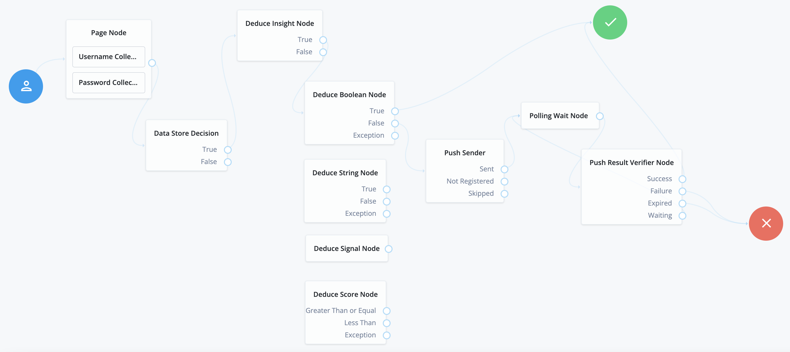

<!--
 * The contents of this file are subject to the terms of the Common Development and
 * Distribution License (the License). You may not use this file except in compliance with the
 * License.
 *
 * You can obtain a copy of the License at legal/CDDLv1.0.txt. See the License for the
 * specific language governing permission and limitations under the License.
 *
 * When distributing Covered Software, include this CDDL Header Notice in each file and include
 * the License file at legal/CDDLv1.0.txt. If applicable, add the following below the CDDL
 * Header, with the fields enclosed by brackets [] replaced by your own identifying
 * information: "Portions copyright [year] [name of copyright owner]".
 *
 * Copyright 2019 ForgeRock AS.
-->
# Deduce Authentication Nodes

The Deduce authentication nodes lets administrators integrate Deduce insight into AM
authentication trees.

## Usage

To deploy these nodes, download the jar from the releases tab on github
[here](https://github.com/ForgeRock/Deduce-Auth-Tree-Nodes/releases/latest). Next, copy the jar into the
../web-container/webapps/openam/WEB-INF/lib directory where AM is deployed. Restart the web container to pick up the
new nodes. The nodes will then appear in the authentication trees components palette.


### Deduce Insight Node
This node makes a request the Deduce Insights API to retrieve summary about the user who is currently authenticating.

#### Deduce Insight Node Configuration

* **Site ID** - Site ID provided by Deduce during onboarding.
* **API Key** - API key provided by Deduce during onboarding.
* **Action** - A contextual input to describe the request. Available actions are:
  * `auth.success`
  * `auth.success.sso`
  * `auth.success.sso.mfaEnabled`
  * `auth.success.password`
  * `auth.success.password.mfaEnabled`
  * `auth.success.mfa.mfaEmailOTP`
  * `auth.success.mfa.mfaSMSOTP`
  * `auth.success.mfa.mfaAuthenticationOTP`
  * `auth.success.mfa.mfaPhysicalToken`
  * `auth.success.mfa.mfaMobilePush`
  * `auth.success.mfa.mfaBiometric`
  * `auth.sucess.link`
  * `auth.success.link.mfaEnabled`
  * `auth.fail`
  * `auth.fail.sso`
  * `auth.fail.sso.userDoesNotExist`
  * `auth.fail.sso.incorrectToken`
  * `auth.fail.password`
  * `auth.fail.password.incorrectPassword`
  * `auth.fail.password.userDoesNotExist`
  * `auth.fail.mfa.expired`
  * `auth.fail.mfa.challengeFailed`
  * `auth.fail.mfa.mfaEmailOTP`
  * `auth.fail.mfa.mfaSMSOTP`
  * `auth.fail.mfa.mfaAuthenticationOTP`
  * `auth.fail.mfa.mfaPhysicalToken`
  * `auth.fail.mfa.mfaMobilePush`
  * `auth.fail.mfa.mfaBiometric`
  * `auth.fail.link`
  * `auth.fail.link.expired`
  * `auth.fail.link.incorrectToken`
* **Enable Test Mode** - Set as true to prevent queries from influencing a user's profile.
* **Endpoint** - The Deduce Insights endpoint.

### Deduce Boolean Node
This node analyzes the response from the Deduce Insights Node and returns either true or false depening on the 
boolean value for the configured field.

#### Deduce Boolean Node Configuration
* **Field** - The name of the boolean field in the response to branch based on.

### Deduce Score Node
This node analyzes the response from the Deduce Insights Node and checks to see if the score is
above the configured value.

#### Deduce Score Node Configuration

* **Field** - The name of the integer field in the response to branch based on.
* **Score Threshold** - The Deduce Insight Response score to compare against.

### Deduce Signal Node
This node analyzes the response from the Deduce Insights Node and checks to see if an individual signal has been 
returned.

#### Deduce Signal Node Configuration
* **Signal outcomes** - The names of signals that have triggered. When a signal is added to this list, a new outcome 
  will added on the node. The node will iterate through the configured signals until a signal is found and 
  will return that outcome. Otherwise the <code>None Triggered</code> outcome will be returned.

### Deduce String Node
This node analyzes the response from the Deduce Insights Node and checks to see if the string matches the configured value.

#### Deduce String Node Configuration

* **Field** - The name of the string field in the response to branch based on.
* **String Value** - The string value that you'd like to compare the field against.
 
### Example Insights JSON
```json
{
  "data": {
    "activity": {
      "email": {
        "frequency": null,
        "ip_count": null,
        "lastseen": null
      },
      "emailip": {
        "frequency": null,
        "lastseen": null,
        "match": false,
        "rank_email": null,
        "rank_ip": null
      },
      "ip": {
        "email_count": 184,
        "frequency": 2629,
        "lastseen": "2022-01-14"
      }
    },
    "alert": false,
    "alerts_enabled": true,
    "device": {
      "ua_brand": "apple",
      "ua_browser": "chrome",
      "ua_device_type": "desktop",
      "ua_name": "mac",
      "ua_os": "macos 10.15",
      "ua_type": "browser",
      "ua_version": "97.0469271"
    },
    "geo": {
      "city": "San Francisco",
      "country": "US",
      "lat": "37.774930",
      "long": "-122.419420",
      "state": "California"
    },
    "network": {
      "company_name": "FORGEROCK, INC.",
      "crawler_name": null,
      "is_corporate": true,
      "is_education": false,
      "is_hosting": false,
      "is_mobile": false,
      "is_proxy": false,
      "is_tor": false,
      "is_vpn_capable": true,
      "is_vpn_confirmed": false,
      "is_vpn_suspect": false,
      "isp_asn": "AS209",
      "isp_name": "CenturyLink Communications, LLC",
      "vpn_name": null
    },
    "sent_timestamp": 1642632657.048,
    "signals": {
      "info": [
        "NETWORK_VPN_CAPABLE",
        "NETWORK_CORPORATE"
      ],
      "risk": [],
      "trust": []
    }
  }
}
```

### Example Flow


